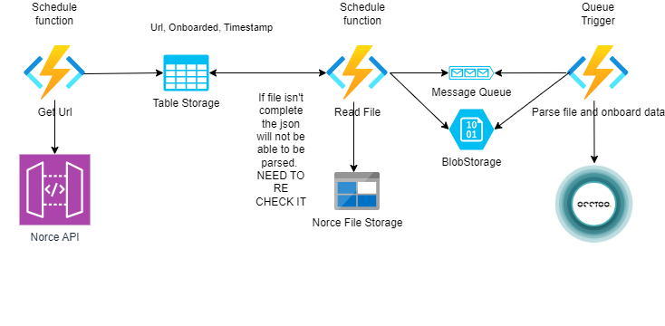

# Norce Provider 
This project gives an example on how to create a Provider from [Norce](https://docs.norce.io/api-reference/) to Occtoo onboarding 

**Docs:** https://docs.occtoo.com/docs/get-started/provide-data

The solution has three function pairs working as shown below:



## Running the app
### 1. Get the code
Clone the repository and open the solution
### 2. Add a localsettings.json file and fill out the details of your project
```json
{
    "IsEncrypted": false,
  "Values": {
    "AzureWebJobsStorage": "UseDevelopmentStorage=true",
    "FUNCTIONS_WORKER_RUNTIME": "dotnet",
    "ProductApi": "ChannelService/api/v1/exports/product",
    "ProductStatusApi": "ChannelService/api/v1/exports/productstatus",
    "BaseApi": "https://rest.storm.io/ChannelService/",
    "ChannelKey": "",
    "StorageConnectionString": "",
    "ProductDataProviderId": "",
    "ProductDataProviderSecret": "",
    "MediaDataProviderId": "",
    "MediaDataProviderSecret": "",
    "PriceDataProviderId": "",
    "PriceDataProviderSecret": "",
    "StockDataProviderId": "",
    "StockDataProviderSecret": "",
    "OcctooBaseAddress": "https://ingest.occtoo.com",
    "NorceProductDataSource": "norceProduct",
    "NorceMediaDataSource": "norceMedia",
    "NorcePriceDataSource": "norcePrice",
    "NorceStockDataSource": "norceStock",
    "ProductDestination": "",
    "ProductTokenUrl": "",
    "ProductTokenSecret": "",
    "ProductTokenClientId": ""
  }
}
```

### 3. Start the application
Hit F5